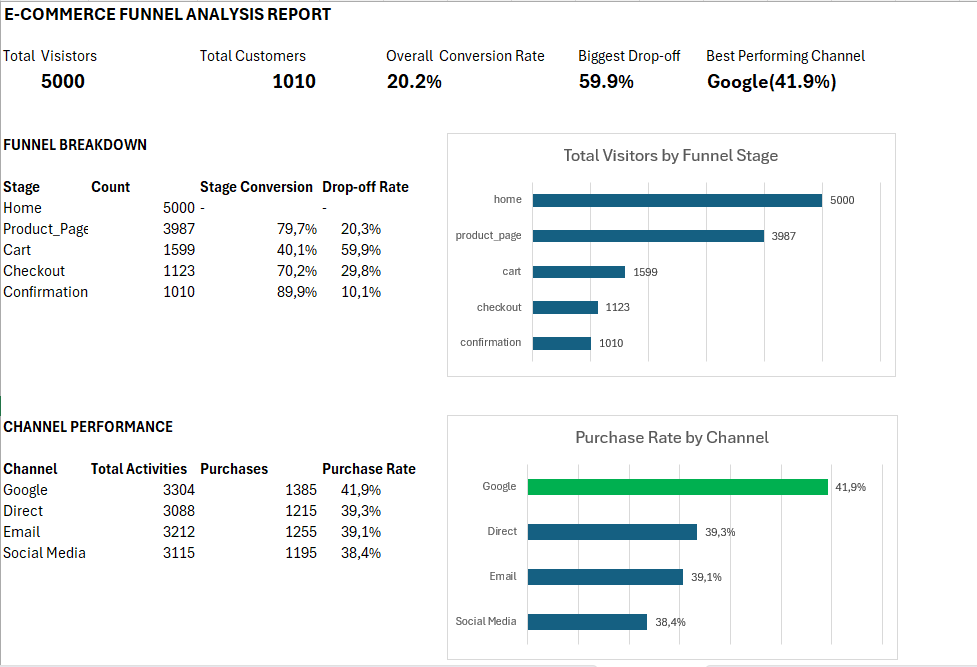

# Marketing Funnel & Conversion Performance Analysis

## Project Overview

This project was completed as part of the Future Interns Data Science & Analytics Internship (Task 3).

The objective was to analyze customer journey and marketing funnel data to identify conversion drop-offs, evaluate channel performance, and uncover opportunities to improve lead-to-customer conversion rates.

An interactive dashboard was developed using Microsoft Excel to visualize funnel progression, conversion performance, channel effectiveness, and customer behavior throughout the purchasing journey.

## Dataset

E-Commerce Customer Journey (Click-to-Conversion Dataset)

The dataset contains customer interaction data across multiple funnel stages, including:

- Home Page Visits
- Product Page Visits
- Cart Activity
- Checkout Activity
- Purchase Confirmation
- Referral Sources
- User Sessions
- Purchase Outcomes

## Tools Used

- Microsoft Excel
- Pivot Tables
- Pivot Charts
- Funnel Analysis
- Conversion Rate Analysis
- Dashboard Design
- KPI Analysis
- Data Cleaning

## Dashboard Features

- Total Visitors KPI
- Confirmed Purchases KPI
- Overall Conversion Rate KPI
- Biggest Funnel Drop-off KPI
- Best Performing Channel KPI
- Funnel Stage Analysis
- Funnel Conversion Analysis
- Channel Performance Analysis
- Purchase Rate by Channel
- Marketing Funnel Dashboard

## Dashboard Screenshot

### Full Dashboard

## Funnel Summary

| Stage | Users |
|---------|---------:|
| Home | 5,000 |
| Product Page | 3,987 |
| Cart | 1,599 |
| Checkout | 1,123 |
| Confirmation | 1,010 |

## Key Findings / Business Insights

1. The marketing funnel experienced a significant decline between the Product Page and Cart stages, with a drop-off rate of 59.9%, making it the largest bottleneck in the customer journey.

2. Out of 5,000 visitors entering the funnel, only 1,010 completed the purchase process, resulting in an overall funnel conversion rate of 20.2%.

3. The Checkout-to-Confirmation stage achieved the highest conversion rate of 89.9%, indicating that users who reached checkout were highly likely to complete their purchases.

4. Google was the highest-performing acquisition channel, generating 3,304 visits and achieving the highest purchase rate of 41.9%.

5. Email, Direct, and Social Media channels generated similar traffic volumes and conversion rates, suggesting relatively balanced marketing performance across channels.

6. User engagement dropped substantially between the Product Page and Cart stages, indicating potential friction related to product presentation, pricing, or purchase motivation.

## Recommendations

1. Optimize product pages by improving product descriptions, product images, customer reviews, and call-to-action buttons to reduce the high Product Page-to-Cart drop-off rate.

2. Introduce incentives such as discounts, promotional offers, free shipping, or limited-time deals to encourage users to add products to their carts.

3. Increase investment in Google marketing campaigns, as Google demonstrated the strongest conversion performance among all acquisition channels.

4. Conduct A/B testing on product page layouts, call-to-action placement, pricing presentation, and promotional messaging to identify opportunities for improving conversions.

5. Maintain the current checkout process, as the Checkout-to-Confirmation conversion rate of 89.9% indicates a smooth and effective purchase experience.

6. Continuously monitor channel performance and allocate marketing resources toward higher-converting channels while optimizing lower-performing traffic sources.

## Files Included

- FUTURE_DS_03.xlsx
- dashboard_full_view.png
- README.md

## Author

Future Interns – Data Science & Analytics Internship

Task 3: Marketing Funnel & Conversion Performance Analysis
